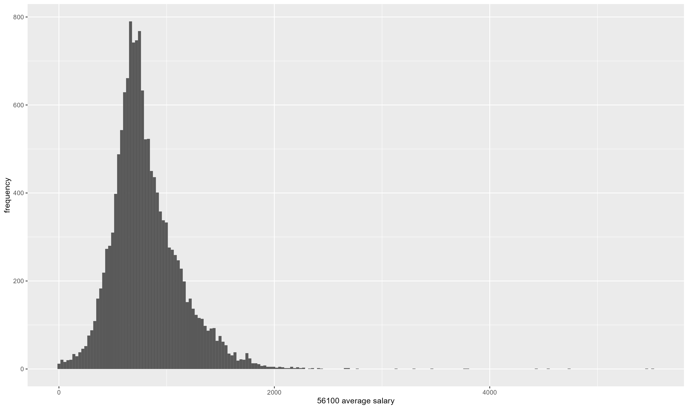
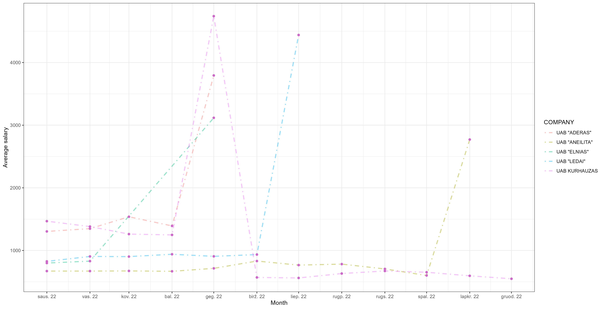
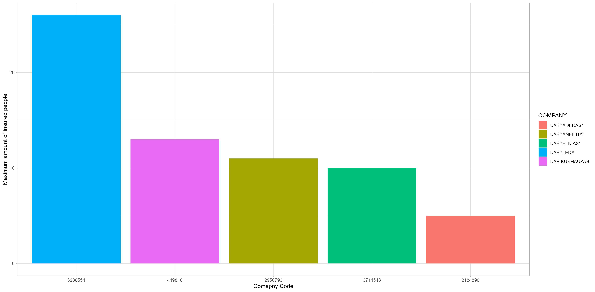

# R Laboratorinis darbas: duomenų vizualizacija

| Variantas | ecoActCode |
|------------- | ------------- |
|2    | 561000 |

### 1. Užduotis

Atsakymas:

Išvados: Galime teigti, jog histograma yra pasiskirsčiusi pagal normalųjį skirstinį. Vidutinis atlyginimas daugiausiai svyruoja
tarp 300 ir 1000. Daugiausiai žmonių, apie 800, gauna atlyginimą, apytiksliai lygų apie 500. Atlyginimus, siekiančius 2000 ir daugiau gauna tik vienetai įmonių darbuotojų.

### 2. Užduotis

Atsakymas:

Išvados: Didžiausi rinkoje atlyginimai pastebimi įmonėje UAB "Kurhauzas". Žemiausi ir labiausiai stabilūs atlyginimai išlieka įmonėje
UAB "Aneilita".

### 3. Užduotis

Atsakymas:

Išvados: Daugiausiai apdraustų darbuotojų randama šmonėje UAB "Ledai", mažiausiai - UAB "Aderas". Apdraustųjų skaičius įmonėse svyruoja
tarp 5 ir apytiksliai 27. Tai gali priklausyti nuo įmonėje dirbančiųjų skaičiaus, todėl negalima teigti, kuri įmonė
yra palankiausia šiuo klausimu.

### 4. Užduotis

Shiny R aplikacijos nuotrauka:

